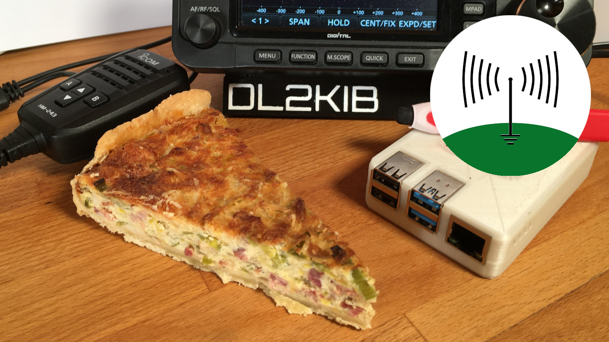

# Quiche Lorraine

> A pie with ham 

This project describes the setup of a Raspberry Pi for amateur radio operations. Its purpose is to evaluate different software packages and describe its configuration on the Raspberry Pi. The target of the project is a running reproducible installation for field use.

## Why on earth bother?

When I started my project, I knew [DL1GKK's article](https://dl1gkk.com/setup-raspberry-pi-for-ham-radio/) and followed some of the steps on my Raspberry Pi. This was quite a while ago. Then I reused the Raspberry Pi. After quite some time, I came back to using the Pi for reception of SSTV images. QSSTV was a bit outdated, so I got back on DL1GKK's site and installed QSSTV again. After some iterations I got tired of this process.

I never considered running a prepared image like the one from W3DJS mainly for security reasons.

Then I stumbled over [KM4ACK's "Raspberry Pi Build for Ham Radio" Youtube series](https://youtu.be/ZhnCvi54zwU). That is a really nice solution, selecting modules and building the software on the Pi.

But! Build-A-Pi provided so many packages I knew nothing about. And, there where still security concerns. I started to create my own build scripts following KM4ACK's example.

But! The scripts got complicated after a while. Refactoring the code into generic BASH functions got more and more complicated and I had no means to model dependancies. Then I started to learn [Ansible](https://www.ansible.com/resources/get-started) for administering a couple of servers. Writing tasks and playbooks seemed a nice solution to my problem. I started my project again with Ansible.

But! After writing my first playbooks, I heard on [Linux in the Hamshack](https://lhspodcast.info/) of the [HamPi project](https://github.com/dslotter/HamPi) using also Ansible. Should I stop my project?

No. I found that most of the playbooks were not idem potent. A re-run of the playbooks needed to much time for my taste. I will stick to my project and explore different Linux tools for amateur radio on the Raspberry Pi.

## Why not bother?

There are already some very usable projects available (see above), which may suit your needs perfectly. I will only write playbooks for things I am interested in at the moment and may even not maintain an old playbook anymore in the future. Deep in my heart I know, we are all doing it wrong! We should all help to maintain the Debian packages or create new ones and contribute to [Debian HAMs](https://wiki.debian.org/DebianHams/) or at least create Debian packages.

But! What if you prefer another distribution or even another OS like one of the BSDs. Perhaps we should concentrate on the old Unix/Linux/BSD standards...

## Structure of the project directory

The `ansible` folder contains my playbooks. The main playbook is `bake.yml`. 

The folder `vars` contains files with variables for all playbooks. It contains the file `main.yml` with the variable for the baking of our pie.

The folder `tasks` contains files with reusable tasks for different classes of installation procedures.

The different tools are to be found in the `roles` folder. Each folder in `roles` contains a different tool.

All the playbooks use [GNU stow](https://www.gnu.org/software/stow/) for managing the installed software in `/usr/local`. This keeps all the different tools and their different versions nice and clean in their own folders below `/usr/local/stow`.

## Installing Quiche-Lorraine

### Prepare a Raspberry Pi

The following steps should only be a reminder. If you have no idea how to complete a step, I suggest reading up on the Raspberry Pi first. You should have a basic understanding of using a Raspberry Pi.

1. Get a Raspberry Pi (preferably a Pi 4 with at least 4 GiB of RAM or better). If your Pi has less RAM you may need swap space to build some packages.
2. Install [Raspberry Pi OS](https://www.raspberrypi.org/software/) "Desktop" preferably on a fast USB-SSD. I use an old M.2 120 GB SSD in a USB3 adapter case. A sd card should work too, but will be a lot slower to build.
3. Boot your Pi. Remember the first run will expand the image and may need quite some time if the sd card or the ssd is very large.
4. Complete the installation wizard.
5. Set the hostname. (You may keep raspberrypi, use lorraine or your own favourite hostname.)
6. Enable ssh access.
7. Reboot the Pi

You may use my other project [bake-a-py](https://github.com/derSuessmann/bake-a-py) for installing the base system and provisioning the Raspberry Pi.

### Prepare your control node

The computer running the Ansible playbooks is called the control node. Normally it is your PC or your laptop. You will need Ansible on the control node. I have no idea how to use Ansible on a Microsoft Windows machine. That is your problem, if you are still using Windows. It is easy on Linux. You just must install the `ansible` package with your distributions package manager on Linux distributions. All the main Linux distributions have it.

1. Install Ansible (e.g. `sudo apt install ansible`).
2. Create a ssh key pair (e.g. `ssh-keygen`). You may certainly use an already existing ssh id.
3. Copy the public key to your Raspberry Pi (e.g. `ssh-copy-id -i ~/.ssh/id_rsa.pub pi@lorraine`)
4. Clone or download the repository (e.g. `git clone https://github.com/derSuessmann/quiche-lorraine.git`)

### Bake your Pi

1. Change `ansible/hosts` if your Raspberry Pi's hostname is not `lorraine`.
2. Chdir to the `ansible` folder.
3. Comment out the packages you do not want on your Raspberry Pi in `bake.yml`.
4. Run `ansible-playbook bake.yml`
5. Stare for a long time on the screen, go for a walk or have a couple of cups of coffee.

## Different desktop environments on the Raspberry Pi

You are free to choose "Desktop and recommended software", "Desktop" or "Lite" for the basic operating system image. Most people want a graphical user interface (and many amateur radio tools need a graphical desktop environment), so most people should use "Desktop". "Desktop and recommended software" contains some big packages you will most probably not need on your Raspberry Pi for amateur radio usage, but your mileage may vary.

"Lite" is not recommended for most users. It does not contain a graphical desktop environment. It is far easier to use the foundation maintained desktop environment in "Desktop" than setting up your own desktop environment. If you want to set up your own preferred desktop environment you should use "Lite". I could not install the GNOME desktop environment on "Desktop". Installing GNOME with "Lite" works like a charm with "Lite".

I have bought a high resolution 10" touch display. The default LXDE based desktop environment in "Desktop" does not work well with touch. GNOME on the other hand is touch oriented. You may install GNOME on your Raspberry Pi OS Lite by setting the variable `install_gnome_minimal` or `install_gnome_full` to `yes` (`install_gnome_full` installs a complete desktop environment with LibreOffice and more).

# Status of the project

The project is far from being stable! The structure is quite brittle. The main reason is the dependencies between the different software projects. In the end it is some sort of mini distribution on top of an existing distribution.

The `bake.yml` playbook currently runs without an error on my Pi. The software it installs seems to work.
